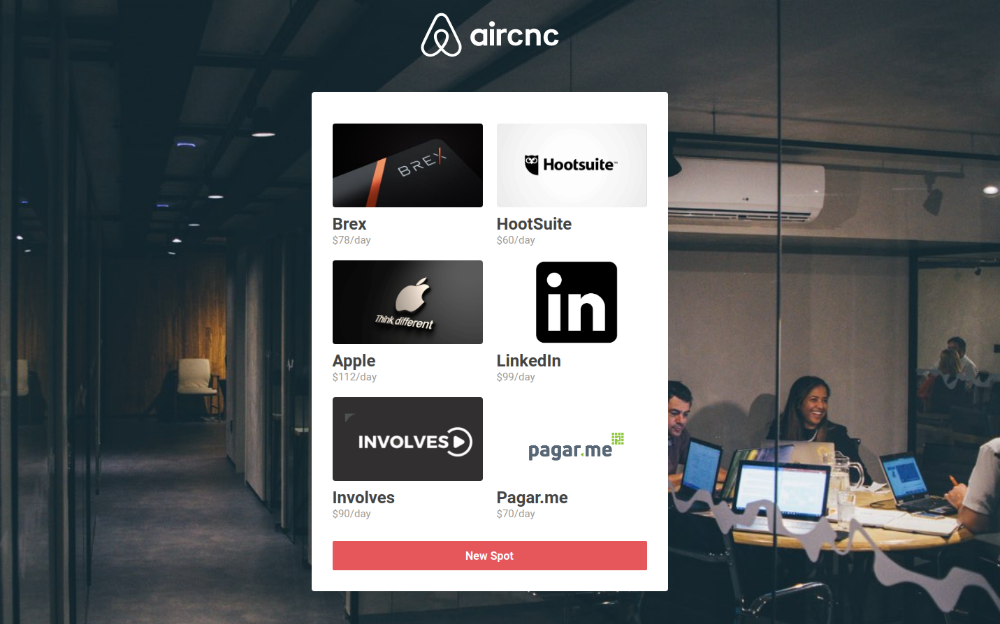

  

  Air Coffee & Code, connecting companies and software engineers.
   
   

  

  >This is a study project only and has no involvement with the Airbnb brand.

 

## Stack

- **Frontend**
  - ReactJS
  - Socket.io
  - Axios
  - \* [check package.json](/frontend/package.json)

- **Backend**
  - Node.js
  - Express
  - Socket.io
  - MongoDB
  - Mongoose
  - Multer
  - \* [check package.json](/backend/package.json)
  
  - **Mobile**
  - React Native
  - Expo
  - Socket.io
  - Axios
  - \* [check package.json](/mobile/package.json)  

## License
[MIT License](https://github.com/daltonmenezes/aircnc/blob/master/LICENSE)
